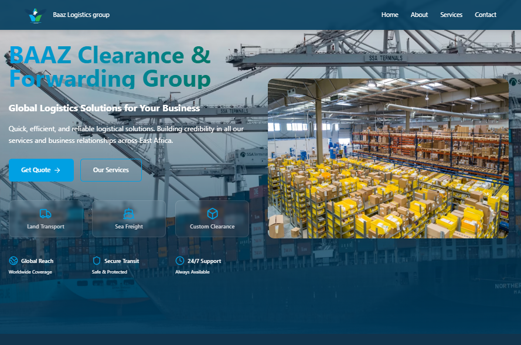

# Baaz Logistics Platform

Baaz Logistics Platform is a cutting-edge logistics website offering global logistics solutions. Designed for efficiency and scalability, it leverages **Remix**, **TypeScript**, and **TailwindCSS** for a seamless user experience.


<video controls src="baz.mp4" title="Baaz Logistics"></video>




## Features

- **Responsive Design**: TailwindCSS ensures a mobile-first, responsive layout.
- **Type Safety**: Built with TypeScript for improved maintainability and fewer runtime errors.
- **Dynamic Content**: Remix powers fast server-side rendering and dynamic routing.
- **Modern Architecture**: Optimized for performance and scalability.

## Technologies Used

- **[Remix](https://remix.run)** - Framework for dynamic web applications.
- **[TypeScript](https://www.typescriptlang.org)** - Type-safe JavaScript alternative.
- **[TailwindCSS](https://tailwindcss.com)** - Utility-first CSS framework.
- **[Vite](https://vitejs.dev)** - Lightning-fast build tool for modern web projects.

## Installation

1. Clone the repository:
   ```bash
   git clone https://github.com/Hythar/baaz-logistics-platform.git
   cd baaz-logistics-platform


2. Install dependencies:
npm install

3. Run the development server:
npm run dev

4. Open your browser and visit:
http://localhost:3000

## Project Structure

baaz-logistics-platform/
├── node_modules/          # Dependencies
├── public/                # Static assets (images, icons, etc.)
├── src/                   # Application source code
│   ├── components/        # components
│   ├── App.tsx            # App
│   ├── index.css          # index
│   └── main.tsx           # main
├── .gitignore             # Files to ignore in Git
├── eslint.config          # ESLint configuration
├── index.html             # Entry HTML file
├── manifest.json          # Web app manifest
├── package.json           # Project metadata and scripts
├── package-lock.json      # Lock file for dependencies
├── postcss.config.js      # PostCSS configuration
├── README.md              # Project documentation
├── tailwind.config.js     # TailwindCSS configuration
├── tsconfig.app.json      # TypeScript configuration for app
├── tsconfig.json          # Base TypeScript configuration
├── tsconfig.node.json     # TypeScript configuration for Node
└── vite.config.js         # Vite configuration


# Available Scripts
npm run dev - Starts the development server.
npm run build - Builds the project for production.
npm run preview - Previews the production build locally.
npm run lint - Runs ESLint for code quality checks.

# Deployment
The project is ready for deployment to platforms like Vercel or Netlify. Follow these steps:

1. Build the project:
npm run build
2. Deploy the dist/ folder to your preferred platform.

# Contributing
Contributions are welcome! Follow these steps:

1. Fork the repository.
2. Create a new branch:
git checkout -b feature/feature
3. Commit your changes:
git commit -m "Add your feature"
4. Push your branch:
git push origin feature/feature
5. Open a pull request.
For feedback or inquiries, feel free to contact us.


### Notes:
1. Update the `public/logo.png` path with the actual screenshot's path in your repository.
2. Adjust any specifics based on your implementation (e.g., additional folders or scripts).

Let me know if you need further refinements!